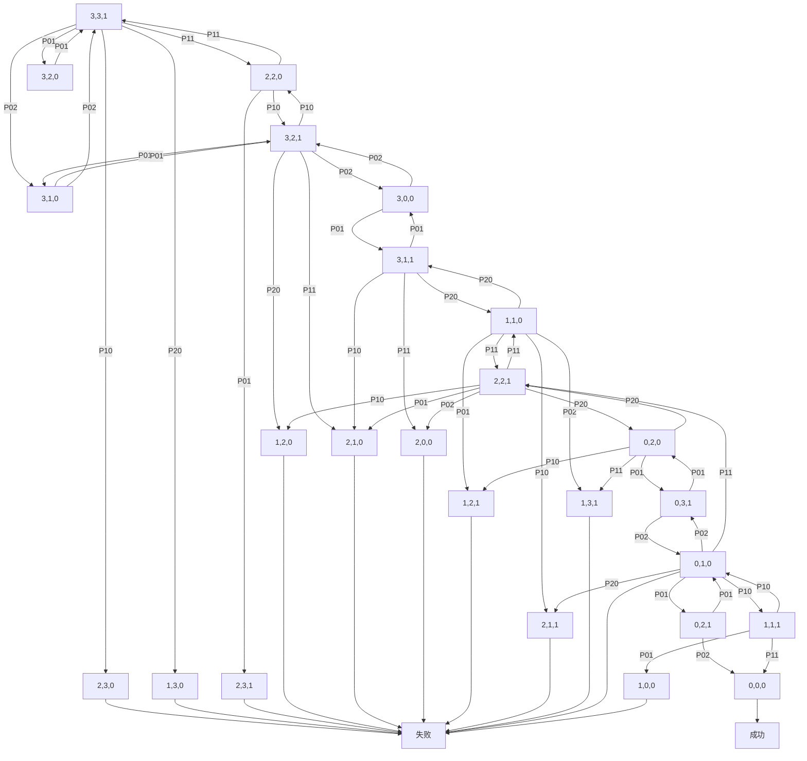

```mermaid
graph TD
A[3,3,1]-->|P11|B1[2,2,0]
A[3,3,1]-->|P01|B2[3,2,0]-->|P01|A[3,3,1]
A[3,3,1]-->|P02|B3[3,1,0]
A[3,3,1]-->|P10|B4[2,3,0]-->Over1[失败]
A[3,3,1]-->|P20|B5[1,3,0]-->Over1[失败]

B1[2,2,0]-->|P01|C1[2,3,1]-->Over1[失败]
B1[2,2,0]-->|P10|C2[3,2,1]
B1[2,2,0]-->|P11|A[3,3,1]

C2[3,2,1]-->|P10|B1[2,2,0]
C2[3,2,1]-->|P20|D2[1,2,0]-->Over1[失败]
C2[3,2,1]-->|P11|D3[2,1,0]-->Over1[失败]
C2[3,2,1]-->|P01|B3[3,1,0]
C2[3,2,1]-->|P02|D5[3,0,0]

B3[3,1,0]-->|P01|C2[3,2,1]
B3[3,1,0]-->|P02|A[3,3,1]

D5[3,0,0]-->|P01|E2[3,1,1]
D5[3,0,0]-->|P02|C2[3,2,1]

E2[3,1,1]-->|P01|D5[3,0,0]
E2[3,1,1]-->|P10|D3[2,1,0]
E2[3,1,1]-->|P20|F2[1,1,0]
E2[3,1,1]-->|P11|F3[2,0,0]-->Over1[失败]

F2[1,1,0]-->|P01|G1[1,2,1]-->Over1[失败]
F2[1,1,0]-->|P10|G2[2,1,1]-->Over1[失败]
F2[1,1,0]-->|P02|G3[1,3,1]-->Over1[失败]
F2[1,1,0]-->|P20|E2[3,1,1]
F2[1,1,0]-->|P11|G4[2,2,1]

G4[2,2,1]-->|P01|D3[2,1,0]
G4[2,2,1]-->|P02|F3[2,0,0]
G4[2,2,1]-->|P10|D2[1,2,0]
G4[2,2,1]-->|P20|H1[0,2,0]
G4[2,2,1]-->|P11|F2[1,1,0]

H1[0,2,0]-->|P01|I[0,3,1]
H1[0,2,0]-->|P10|G1[1,2,1]
H1[0,2,0]-->|P20|G4[2,2,1]
H1[0,2,0]-->|P11|G3[1,3,1]

I[0,3,1]-->|P01|H1[0,2,0]
I[0,3,1]-->|P02|J[0,1,0]

J[0,1,0]-->|P01|K1[0,2,1]
J[0,1,0]-->|P02|I[0,3,1]
J[0,1,0]-->|P10|K2[1,1,1]
J[0,1,0]-->|P20|G2[2,1,1]
J[0,1,0]-->|P11|G4[2,2,1]

K1[0,2,1]-->|P01|J[0,1,0]-->Over1[失败]
K1[0,2,1]-->|P02|L[0,0,0]-->S[成功]

K2[1,1,1]-->|P01|L2[1,0,0]-->Over1[失败]
K2[1,1,1]-->|P10|J[0,1,0]
K2[1,1,1]-->|P11|L[0,0,0]

```