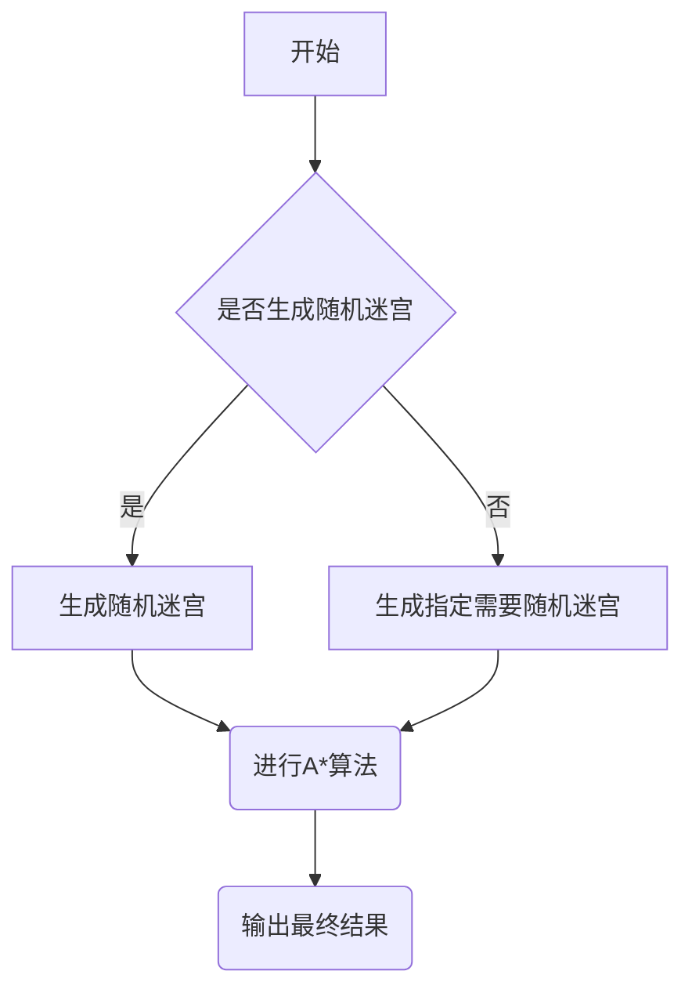
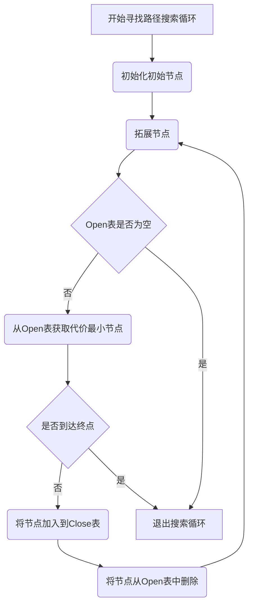
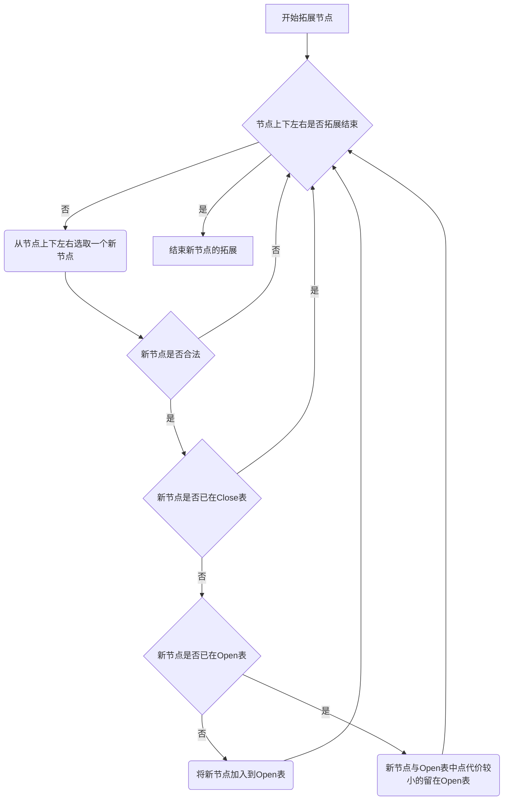

## 启发式算法求解迷宫问题

[内容参考](https://github.com/DiamonJoy/MAZE)

------

- 最终生成文件：A_Star_Maze.exe
- 头文件：default.h
- 主文件：main.cpp

------

### 说明

**关于语言编码**

所有文件都采用UTF-8进行编写

**关于头文件**

由于随机生成迷宫的不确定性，可能存在不包含合法路径的情况，因此在头文件中定义了四个缺省迷宫作为算法的展示。

**关于算法**

算法采用了Open表和Close表，每一次搜索都先拓展当前节点的上下左右四个点，并进行合法性检查，将合法的节点与Open表和Close表进行比对。如果拓展节点位于Close表则表明该节点已经被使用过，故忽略；如果拓展节点位于Open表则表明该节点在之前的某次搜索中已被添加，此时比对目前节点的代价和表中节点的代价，保留代价较小的情况；若Open表与Close表都不包含当前节点，则加入Open表。

节点拓展结束后，需要从Open表中寻找到代价最小的节点作为当前节点，并对节点是否到达终点进行判断，若到达了终点则开始将本节点及其所有父节点组成的链表写入到Path表中。若未到达终点，则将该节点从Open表中删除并加入到Close表中，表示该节点已被搜索。

搜索结束后，需要更新迷宫的地图。将Open表和Close表中的所有节点全部导入到Searched表中，并将Searched表中的所有节点在地图上以*字符表示出来，同时将Path表中的所有节点在地图上以+字符表示出来。

**Python至C++转换**

参考的A*算法使用了Python，其中Open表与Close表使用了Python的List作为存放容器。由于Python的特性，该过程在C++难以完美实现，故在C++中，使用了vector容器作为存放的表，并定义了相关的操作函数。

**System()函数等相关**

为了实现在控制台上进行的清屏操作，使用了system()函数输入了cmd命令，如pause和cls等，这些命令无法在非Windows下解析，此外，作为高亮的函数的库，windows.h也可能在其他OS下无法解析。

**亟待更新**

在参考中有get_start()和get_end()函数来获取起始和终止位置的坐标，而在本程序中起始和终止位置默认设定在左上与右下角。可以修改随机生成函数在迷宫内部随机生成起始与终止点。

------

### 流程图
#### 主程序流程图

#### A*算法流程图

#### 拓展节点算法流程图

